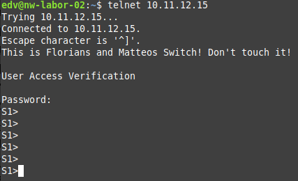

Name: Florian Unterpertinger, Matteo Reiter <br>
Jahrgang: 2023/24 <br>
Gruppe: 4AHEL/H <br>
Betreuer: Markus Signitzer <br>

# 01 Switching

## Grundwissen

> ## 1. Vorwissen
>
> Um die Übung erfolgreich zu absolvieren, müssen folgende Fragen zu Beginn der
> Übung beantwortet werden und ebenfalls im Laborbericht (auch die Fragen zu den
> einzelnen Übungen unten) behandelt werden:
> 
> - Was ist ein Switch? Wie funktioniert er? In welchem OSI-Layer arbeitet er?
>   Wie erlernt er die MAC-Table?
> - Wie kann man auf den Switch zugreifen?
> - Was ist ein Switch virtual interface (SVI)? 
> - Was ist ein VLAN? Wofür sind sie gut?
> - Was ist ein Trunk?
> - Was bedeutet encapsulation?
> 
> Grundlegenden Informationen findet man im CISCO CCNA R&S Routing and
> Switching Essentials Kurs in den Kapiteln 2 und 3 (dies gilt für die Kursversion 5.0 – vom Jahr 2016)

### Antworten

1. Ein Switch ist ein Verteiler für Ethernet Frames und arbeitet auf Layer 2. Er verteilt Frames gezielt an notwendigen Empfänger. In dem Frames mit einer bestimmten Source-MAC an einem Port ankommen, merkt er sich mittels MAC-Address-Table dass der entsprechende Host mit diesem Port verbunden ist und sendet frames für diesen Host zukünftig nur noch an diesen Port. Wenn Zielport noch nicht bekannt ist, wird ein frame an alle Ports (außer source port) "gefloodet".

2. Über die Console, SSH oder Telnet
3. Ein Virtuelles Netzwerk Interface um mittels SSH/Telnet eine Verbindung mit dem Switch aufzubauen
4. Virtuelles Netzwerk; Unterteilung der Ports eines Switches 
5. Verbindung zur gleichzeitigen Übertragung von mehreren Signalen 
6. Das verpacken von higher-layer-PDUs in die der niedrigeren Layer.

## Übungen


> ## 2.1 Plug and Play Switch
> 
> Zwei PCs (Achtung IP-Config - selbes Netzwerk!) sollen mit >einem Switch verbunden
> werden. Connectivity mit pings überprüfen.
> 
> - Funktioniert die Verbindung? 
> - Warum geht der erste ping eventuell verloren?
>

### Antworten

PCs werden auf gleichen switch verbunden (andere PCs sind auch schon drauf, stören aber nicht):


Beide PCs werden auf dem gleichen subnetz konfiguriert:

```
PC1: 10.11.12.13/24
PC2: 10.11.12.14/24
```

Pings Funktionieren:

PC1 -> PC2:


PC2 -> PC1:


Anfangs kann es sein dass die ersten ping versuche Fehlschlagen da die MAC Adresse des anderen Hosts erst mittels ARP Protokoll ermittelt werden muss.

### Kommentare 
Ausführung hat ohne Probleme stattgefunden. 

> ## 2.2 Switch Configuration
>
> Auf das Switch IOs mit Hilfe des Console-Kabels zugreifen und folgende Konfigurationen vornehmen: Hostname, Passwörter für Fernzugriff und Konfiguratiosebenen sowie ein Banner-MOTD setzen. Denn Switch für Telnetzugriff konfigurieren (SVI) und den Telnet-Zugang testen.
> - Wo bzw. wie kann man sich die aktuelle Switch Konfiguration ansehen?
> - Wie kann man die Passwörter in der Konfiguration verschlüsseln?
> - Warum soll man Telnet nicht verwenden? Mit Wireshark das Telnet-PW mithören. Wie konfiguriert man einen sicheren Fernzugriff (SSH)? Wieder mit Wireshark „mithören“. 

Konfiguration:

```python
enable
    conf t
        hostname S1 # S1 is hostname
        banner modt "This is Florian's and Matteo's Switch! Don't touch it!"
        enable password Hallo # "Hallo" ist pwd für "enable" config ebene
        username Matteo password Flo    # Für Fernzugriff Benutzername "Matteo" mit Passwort "Flo"
        ip domain-name test # Domain-Name für den RSA Key (braucht man für SSH)
        crypto generate key rsa # Keys für SSH generieren
            2048    # Key Größe wird abgefragt
        ip ssh version 2        # Neuest-mögliche SSH Version damit mit Linux kompatibel
        service password-encryption # verschlüsselter speicher (nicht im klar text running config speichern)
        line vty 0 15   # Konfiguration für alle Lines
            password Hallo  # Passwort für Fernzugriff
            login local     # Fernzugriff aktivieren mit Benutzer-Passwort-Anmeldung
            transport input all     # sowohl SSH also auch Telnet erlauben (zum testen)
            exit
        interface vlan 1    # SVI damit switch eine IP hat (hier auf VLAN 1)
            ip address 10.11.12.15  255.255.255.0   # Switch bekommt .15
            no shut
            exit

```

Telnet funktioniert:



SSH funktioniert:


### Antworten

1. Config anzeigen: 
   ```python
   enable
       show running-config
       # Wenn man in conf t oder einer andern eben ist dann "do" davor
       conf t
           do show running-config
   ```
2. Passwörter verschlüsseln:
   ```python 
    enable 
        conf t 
            service password-encryption
   ```
3. Telnet ist nicht verschlüsselt, jeder kann eingegebenen text (inkl. Passwort) mitlesen:<br>
   <br>
   (Jeder Buchstabe ist in einem eigenen Frame und IP Packet)<br>
   Bei SSH ist die gesamte Kommunikation verschlüsselt, man kann nichts Herauslesen:<br>
   

### Kommentare 

Problem beim konfigurieren von SSH mit der Key-Länge und SSH Version, nach kurzer Absprache mit dem Lehrer allerdings behoben 


> ## 2.3 Zwei Switches mit VLANs:
> Einen zweiten Switch ins Netzwerk bringen und konfigurieren. Drei VLANs einrichten
> und zwischen den Switches einen Trunk konfigurieren.
> Die zwei PCs jetzt auf die zwei Switches aufteilen und die Connectivity in gleichen
> und unterschiedlichen VLANs überprüfen.
> - Wie unterscheiden die Switches Packages aus verschiedenen VLANs am Trunk?
> - Was ist ein native VLAN?
> - Was ist die Rolle vom VLAN-1 bei Cisco-Devices?

Config muss auf beiden Switches durchgeführt werden (ports sind auf beiden identisch). Die basis config von zuvor wird vorausgesetzt:

```python
enable
    conf t
        vlan 10 # enter config for vlan 10
            name "ports1to10"
            exit
        vlan 20
            name "ports11to20"
            exit
        # move port FE0/1 - FE0/10 to the new vlan 10
        interface range fastEthernet 0/1 - 10   # eventuell gigabitEthernet (je nach switch)
            switchport mode access
            switchport access vlan 10 # creates vlan 10 if it doesn't exit yet
            no shut
            exit
        # do the same with FE0/11 - FE0/20
        interface range fastEthernet 0/11 - 20  # eventuell gigabitEthernet (je nach switch)
            switchport mode access
            switchport access vlan 20 # creates vlan 20 if it doesn't exit yet
            no shut
            exit
        interface fastEthernet 0/24 # eventuell gigabitEthernet (je nach switch)
            switchport trunk encapsulation dot1q    # nur falls der switch das unterstützt oder erfordert
            switchport mode trunk
            switchport trunk allowed vlan 10,20
```

Ergebnis:

Die beiden PCs können nur dann kommunizieren, wenn sie sich im gleichen VLAN befinden, egal an welchem Switch. Das wurde durch Pings bestätigt.


Sind die PCs in unterschiedlichen VLANs, egal ob am gleichen Switch oder kreuzweise, so können sie nicht Kommunizieren:


### Antworten 

1. Sie unterschiedlichen Frames werden im Header mit der VLAN Nummer versehen (Tagging)
2. Das Native VLAN ist das VLAN, ohne Modifikation der Frames (ohne Tagging) über einen Trunk geleitet wird. Diese erspart Rechenaufwand beim Switch, ist aber veraltet, nicht sicher und sollte nicht verwendet werden.
3. Ein Switch von Cisco hat zusätzlich zum VLAN 1 auch ein „interface Vlan1“. Hierbei handelt es sich um eine logische Schnittstelle, die über den Systembus mit dem VLAN 1 verbunden ist. Auf dieses Interface wird die IP-Adresse des Switches konfiguriert. 

### Kommentare 

Ausführung hat ohne Problemen stattgefunden.