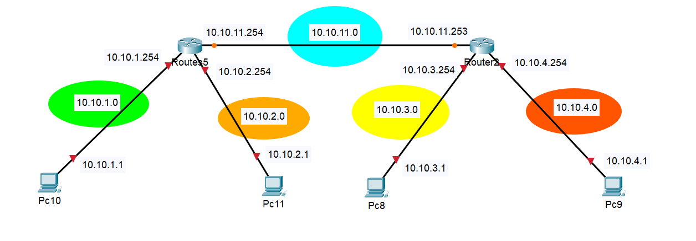
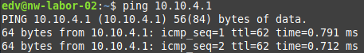

Name: Florian Unterpertinger, Matteo Reiter <br>
Jahrgang: 2023/24 <br>
Gruppe: 4AHEL/H <br>
Betreuer: Markus Signitzer <br>

# 02 Routing


> ## 1. Grundwissen
> 
> Um die Übung erfolgreich zu absolvieren, müssen folgende Fragen zu Beginn der Übung beantwortet werden können:
> - Was ist ein Router? Wie funktioniert er? In welche OSI-Layer arbeitet er? Warum ist er kein Plug&Play Device wie ein Switch?
> - Wie kann man auf den Router zugreifen?
> - Wie funktioniert DHCP? 
> - Wie funktioniert statisches Routen? Wie dynamisches? Wie konfiguriert man RIP? 
> 
> Grundlegenden Informationen findet man im CISCO CCNA R&S Routing and Switching Essentials Kurs in den Kapiteln 6,7, und 8 (dies gilt für die Kursversion 5.0
> – gültig im Jahr 2016)

### Antworten 
1. Gerät zum verbinden von Netzwerken; über den Routing-Table leitet er Layer 3 (IP) Packets an die Zieladressen weiter, Die Routen im Routing-Table können manuell (statisch) oder automatisch (dynamisch) mit einem Routing-Protokoll (RIP, OSPF, ...)hinzugefügt stellt werden; Layer 3 (Network Layer); Da der Routing-Table zuerst konfiguriert werden muss, er kann nicht automatisch ermittelt werden (ohne dass ein Routing-Protokoll aktiviert wird)
2. Console, SSH, Telnet
3. Das verbindungssuchende Geräte erhält automatisch eine Netzwerkadresse (IP-Adresse)<br>
Schritte:
  - PC schickt Discovery Packet (broadcast)
  - DHCP server antwortet mit Offer (unicast)
  - Wenn PC die angebotene Adresse will, antwortet er mit einem DHCP-Request Packet (unicast)
  - Server beendet handshake mit Acknoledgement Packet (unicast)

4. Statische Routen: Die Routen zu bestimmten Netzwerken werden manuell eingegeben.<br>
Dynamische Routen: Router tauschen Routen automatisch untereinander aus.<br>
z.B. RIP: [Später erklärt](#22-dynamiches-routen)


## 2. Übungen

> ### 2.1 Router Setup und statische Routen:
> Zugriff auf einen Router mit der Console. Am Router den Hostname und DHCP (IP, Gateway) konfigurieren.
> - Zwei Interfaces konfigurieren und zwei Pcs/Laptops anschließen. Funktioniert DHCP? Welche Information bekommen die PCs vom Router? 
> - Einen zweiten Router, ebenfalls mit DHCP (unterschiedliches Netz!) konfigurieren und ebenfalls zwei PCs / Laptops anschließen. 
> - Die zwei Router nun verbinden und statische Routen in die Routing-Table eintragen. Funktioniert ein Ping zwischen den verschiedenen Netzen?


Grundkonfiguration:

Interfaces:
- gig0/0 = PC10, NET: 10.10.1.0/24
- gig0/1 = PC11, NET: 10.10.2.0/24


```python

enable
    conf t
        hostname R5 # S1 is hostname
        # Für basis config mit zwei PCs
        interface gig 0/0
            ip address 10.10.1.254 255.255.255.0    # IP .254 on interface = router
            no shut
        interface gig 0/1
            ip address 10.10.2.254 255.255.255.0    # IP .254 on interface = router
            no shut
            exit
        ip dhcp pool N1
            network 10.10.1.0 255.255.255.0
            default-router 10.10.1.254
            exit
        ip dhcp pool N2
            network 10.10.2.0 255.255.255.0
            default-router 10.10.2.254
            exit
```

Antworten:

1. DHCP funktioniert, die beiden PCs bekommen eine IP Adresse:<br>

 <br>
 <br>
Die Beiden PCS können sich pingen:
<br>
<br>

2. Die Gruppe Niclas & Lilo konfigurieren den zweiten Router

3. Für die Verbindung der Router verwenden wird die Ports am Mini-Switch HWIC-4ESW (mit VLANS für Zugriff auf Ports):



```python
        # Für Verbindungsleitung mit anderem Router über mini-switch (mit switch port 0 verbinden):
        interface fastEthernet 0/0/0
            switchport mode access
            switchport access vlan 2    # beliebige VLAN ID
            no shut
            exit
        interface vlan 2
            ip address 10.10.11.254 255.255.255.0
            no shut
            exit
        # Statische Routen
        ip route 10.10.3.0 255.255.255.0 10.10.11.253
        ip route 10.10.4.0 255.255.255.0 10.10.11.253
```

Gleiches macht die andere Gruppe. Danach kann man zwischen den Netzwerken pingen (hier 10.10.1.1 -> 10.10.4.1):<br>



> ## 2.2 Dynamisches Routen:
> Nun euer kleines 2-Router Netzwerk auf RIP umstellen und erneut auf Connectivity
> überprüfen.
> - Wie funktioniert RIP?
> - Wenn eurer Netzwerk wie erwartet funktioniert, dann mit den Netzwerken der anderen Laborgruppen verbinden. Achtung auf IP-Konfigurationen, es darf keine gleichen Netze geben!
> - Funktioniert der Ping von einer Gruppe zur nächsten? 

Umkonfiguration des kleinen Netzwerks auf RIP:
```python 
enable
    conf t
        # Statische Routen wieder ausschalten
        no ip route 10.10.3.0 255.255.255.0 10.10.11.253
        no ip route 10.10.4.0 255.255.255.0 10.10.11.253
        # RIP konfigurieren
        router rip 
            version 2
            no auto-summary
            # Verbundenen Netzwerke angeben über die andere Router informiert werden sollen
            network 10.10.1.0
            network 10.10.2.0
            network 10.10.11.0
            # PC Interfaces passiv machen
            passive-interface gig0/0
            passive-interface gig0/1
```

Nun funktioniert alles wie zuvor, mit dem Ping in Netzwerk N4.

Antworten:

1. Wie funktioniert RIP? <br>
   Jeder Router teilt alle 30 Sekunden den anderen Routern seine Konfiguration und Ports mittels broadcast mit. RIP ist ein altes Protokoll, die beste Route, über die ein Paket geroutet wird, wird anhand des Hop-Count festgestellt, was nicht die beste Möglichkeit ist.

2. Um mehrere Gruppen zu verbinden wird ein weiteres VLAN am Mini-Switch festgelegt mit dem ein weiteres Netzwerk verbunden wird. Wenn alle Gruppen ihren Router interfaces die gemeinsam Festgelegten IP Adressen geben und RIP aktiviert haben, dann sollten die Routen dann automatisch gefunden werden.

Gemeinsam ausgemachtes Netzwerk:


3. Das Netzwerk hat funktioniert (getestet bis auf R11 der bis Stundenende noch nicht fertig konfiguriert war). Die Übung wurde allerdings abgebrochen, daher konnten keine Pings Aufgezeichnet werden.

> ## 2.+ Zusatzaufgaben Zweite Einheit
> Es wird wieder ein Netzwerk mit vielen Routern und PCs aufgebaut, alle sollen sich gegenseitig Pingen können.
> - Verwendet RIP
> - Statische IPs sind OK
> - Jeder einen Router, an jedem Router ein PC

Die Konfiguration is abgesehen von dem nicht verwendeten DHCP Pools ident zur letzten Aufgaben, nur mit etwas anderen IPs.

Das Netzwerk wird nach folgendem Plan aufgebaut:<br>


Mit ```do show ip route``` kann man überprüfen ob alle Netzwerke gefunden wurden:<br>


Der PC kann auch auf andere Netzwerke zugreifen, mit dem Befehl ```traceroute <ip>```(Windows) oder ```tracepath <ip>``` (Linux): <br>


### Kommentare 
Ausführung hat großteils Probleme stattgefunden, lediglich bei der Gemeinsamen Übung sind nicht alle rechtzeitig fertig geworden. 